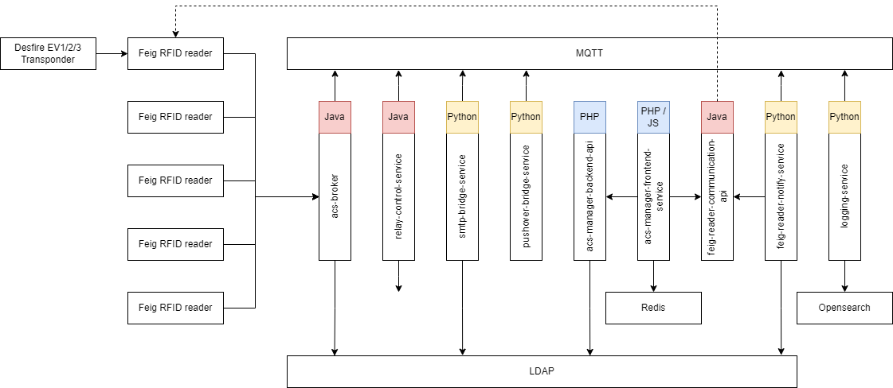

# OITC Access Control System (ACS)

Architecture documentation for the OITC Access Control System.

## System Overview

The OITC Access Control System is a native, event-driven microservice architecture designed for flexibility and scalability. It provides real-time access control management for physical facilities, integrating with IoT devices such as door locks and RFID readers.

The system can be deployed on a single Docker Compose host for smaller installations or scaled out to Kubernetes clusters for enterprise deployments. It runs completely self-contained without vendor-specific dependencies.

> **Note:** Each box in the architecture diagram represents a microservice or service available as a Docker container, with the exception of the RFID Reader and RFID Transponder, which are physical IoT hardware devices.

## Architecture Diagram



## Technology Stack

| Category | Technology |
|----------|------------|
| Container Platform | Docker, Docker Compose, Kubernetes |
| Backend | Python, Java, PHP |
| Frontend | PHP, JavaScript |
| Database | OpenSearch |
| Messaging | MQTT |
| Authentication & Configuration | LDAP |
| Notifications | SMTP, Pushover |

## System Components

### 1. IoT Device Layer

Physical access control hardware that connects to the system:

- **Door Lock** - Electronic door locking mechanism (controlled via relay)
- **RFID Reader** - Reads RFID transponders for authentication (physical device)
- **RFID Transponder** - Badge/token carried by users (physical device)

### 2. ACS Broker

Central message broker service that handles device event routing. Validates access credentials against the LDAP backend and publishes results to MQTT topics for downstream services.

### 3. ACS Manager Backend API

REST API for managing system configuration stored in the LDAP backend. Handles user management, access rules, and system settings.

### 4. FEIG Reader Communication API

REST API for direct communication with Feig RFID readers. Operates in Host Mode to query reader status and send control signals.

### 5. Relay Control Service

Subscribes to MQTT access events and triggers the corresponding door relay on successful authentication. Controls physical door lock mechanisms.

### 6. SMTP Bridge Service

Sends email notifications about access attempts. Publishes detailed access event information to configured email recipients.

### 7. Pushover Bridge Service

Sends Pushover push notifications about access attempts to mobile devices. Provides real-time alerts for configured users.

### 8. Logging Service

Logs all access attempts to the OpenSearch database. Provides centralized logging and searchable audit trail for compliance and security analysis.

### 9. FEIG Reader Notify Service

Determines the appropriate signal to send to the RFID reader based on access decisions. Communicates with the FEIG Reader Communication API to trigger reader feedback (e.g., green/red LED, buzzer).

### 10. ACS Manager Web GUI / Frontend Service

PHP and JavaScript web application for system administration. Acts as a gateway service that routes web requests to the appropriate backend APIs.

Provides interfaces for:

- User and access rule management
- Device configuration
- RFID transponder initialization
- Access event monitoring
- System settings

Communicates with:

- `acs-manager-backend-api` for configuration management
- `feig-reader-communication-api` for reader operations

## Data Flow

### Access Control Flow

```
1. RFID Transponder → RFID Reader → ACS Broker
2. ACS Broker → LDAP (validate credentials)
3. LDAP → ACS Broker (validation result)
4. ACS Broker → MQTT Topic (access decision)
5. MQTT → Relay Control Service → Door Lock
6. MQTT → Logging Service → OpenSearch
7. MQTT → SMTP Bridge Service → Email notification
8. MQTT → Pushover Bridge Service → Push notification
9. MQTT → FEIG Reader Notify Service → FEIG Reader (feedback signal)
```

### Configuration Management Flow

```
ACS Manager Web GUI → ACS Manager Backend API → LDAP
```

### Reader Communication Flow

```
ACS Manager Web GUI → FEIG Reader Communication API → RFID Reader
```

## Containerized Microservices

All services in this architecture are packaged and deployed as Docker containers:

| Service | Container |
|---------|-----------|
| ACS Broker | Docker container |
| ACS Manager Backend API | Docker container |
| FEIG Reader Communication API | Docker container |
| Relay Control Service | Docker container |
| SMTP Bridge Service | Docker container |
| Pushover Bridge Service | Docker container |
| Logging Service | Docker container |
| FEIG Reader Notify Service | Docker container |
| ACS Manager Web GUI / Frontend Service | Docker container |

## Deployment Options

### Single Host (Docker Compose)

For smaller installations, all services run on a single Docker Compose host:

- Simple deployment and management
- Suitable for single building/facility
- Shared network for all containers

### Kubernetes Cluster

For enterprise deployments, the system scales to Kubernetes:

- Horizontal pod autoscaling
- High availability and fault tolerance
- Load balancing across multiple nodes
- Suitable for multiple facilities/locations

## Communication Patterns

### MQTT Message Broker

All services communicate via MQTT topics for decoupled, event-driven architecture:

- Access decisions published to topics
- Services subscribe to relevant topics
- Loose coupling between components

### REST APIs

Synchronous communication for configuration and web requests:

- ACS Manager Web GUI → ACS Manager Backend API
- ACS Manager Web GUI → FEIG Reader Communication API

## Key Features

1. **Containerized Microservices** - All services deployed as Docker containers
2. **Flexible Deployment** - Single host or Kubernetes cluster
3. **Event-Driven Architecture** - MQTT-based pub/sub messaging
4. **LDAP Centralized Management** - Authentication and system configuration
5. **Real-time Logging** - OpenSearch for audit trails and analytics
6. **Multi-channel Notifications** - Email and Pushover alerts
7. **Cloud-Agnostic** - Runs anywhere with Docker support

## Repository Structure

```
acs.documentation/
├── README.md           # This file
├── LICENSE             # License information
└── media/              # Architecture diagrams and images
    ├── acs-pushover-icon.png
    └── 2026-03-21-microservice-architecture.png
```

## Documentation

- [Architecture Overview](docs/architecture-overview.md) - Detailed system architecture
- [API Reference](docs/api-reference.md) - Web API documentation
- [IoT Integration Guide](docs/iot-integration.md) - Device connection guidelines
